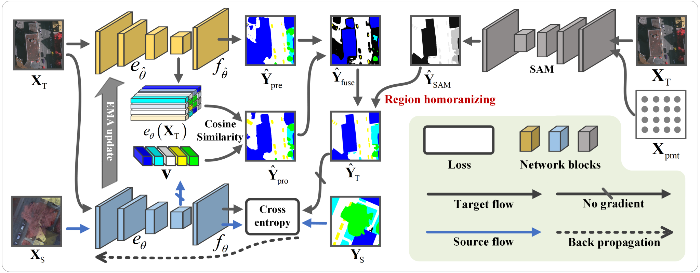

<h2 align="center">Learn from Segment Anything Model: Local Region Homogenizing for Cross-domain 
Remote Sensing Image Segmentation</h2>

<h5 align="center">by <a href="https://scholar.google.com/citations?user=LXlWdyQAAAAJ&hl=zh-CN">Wang Liu</a>, 
Puhong Duan, Zhuojun Xie, Xudong Kang, and Shutao Li</h5>


---------------------

<h5 align="left">This is the official implementation for 
<a href="https://scholar.google.com/citations?user=LXlWdyQAAAAJ&hl=zh-CN">RegDA</a>. 
There are some differences comparing with the published paper.</h5>

- The denoising approach in this repository is re-weighting, while in the paper is voting;
- A class-frequency threshold is utilized to guide the pseudo-label homogenizing. 
For each local region, if the class with a larger frequency than this threshold, 
it will be employed for homogenizing;
- The LRH is also utilized in the aligning stage.

---------------------

<div align=center></div>
<p align="center">Fig. 1 An overview of the proposed RegDA.</p>


## Getting Started

### Environment:
- conda create -n regda python=3.8
- source activate regda
- pip install torch==1.8.1+cu111 torchvision==0.9.1+cu111 torchaudio==0.8.1 -f https://download.pytorch.org/whl/torch_stable.html
- conda install pytorch-scatter -c pyg
- pip install -r requirement.txt
- pip install -e .

### Prepare datasets

#### 1. Generate from raw:

- Download the raw datasets <a href="https://www.isprs.org/education/benchmarks/UrbanSemLab/2d-sem-label-potsdam.aspx">here</a>.
- Run the preprocess script in ./convert_datasets/ to crop train, val, test sets:\
`python convert_datasets/convert_potsdam.py`\
`python convert_datasets/convert_vaihingen.py`
- Generate local regions by running \
`python tools/seg_everything.py`
#### 2. Alternatively, you can also download the processed data
- Download the processed datasets <a href="https://pan.baidu.com/s/1rWHSgRpSVPlLt5_bykHCOg?pwd=6th5">here</a>.
- reorganize the directory tree.
#### 3. The prepared data is formatted as follows:
"\
./data\
----&nbsp;IsprsDA\
&nbsp;&nbsp;&nbsp;&nbsp;&nbsp;----&nbsp;Potsdam\
&nbsp;&nbsp;&nbsp;&nbsp;&nbsp;&nbsp;&nbsp;&nbsp;&nbsp;&nbsp;----&nbsp;ann_dir\
&nbsp;&nbsp;&nbsp;&nbsp;&nbsp;&nbsp;&nbsp;&nbsp;&nbsp;&nbsp;----&nbsp;img_dir\
&nbsp;&nbsp;&nbsp;&nbsp;&nbsp;&nbsp;&nbsp;&nbsp;&nbsp;&nbsp;----&nbsp;reg_dir\
&nbsp;&nbsp;&nbsp;&nbsp;&nbsp;----&nbsp;Vaihingen\
&nbsp;&nbsp;&nbsp;&nbsp;&nbsp;&nbsp;&nbsp;&nbsp;&nbsp;&nbsp;----&nbsp;ann_dir\
&nbsp;&nbsp;&nbsp;&nbsp;&nbsp;&nbsp;&nbsp;&nbsp;&nbsp;&nbsp;----&nbsp;img_dir\
&nbsp;&nbsp;&nbsp;&nbsp;&nbsp;&nbsp;&nbsp;&nbsp;&nbsp;&nbsp;----&nbsp;reg_dir\
"

### Evaluate the trained RegDA models.\
Download the pre-trained [<b>weights</b>](https://pan.baidu.com/s/1rWHSgRpSVPlLt5_bykHCOg?pwd=6th5) and logs.
#### 1. on Vaihingen (IRRG) -> Potsdam (IRRG) task
Run evaluating: `python tools/eval.py --config-path st.regda.2potsdam --ckpt-path log/regda/2potsdam/ssl/Potsdam_best.pth --test 1`
#### 2. on Potsdam (IRRG) -> Vaihingen (IRRG) task
Run evaluating: `python tools/eval.py --config-path st.regda.2vaihingen --ckpt-path log/regda/2vaihingen/ssl/Vaihingen_best.pth --test 1`

### Train the RegDA
```bash 
bash runs/regda/run_2potsdam.sh
```
```bash 
bash runs/regda/run_2vaihingen.sh
```

### Inference single file
```bash 
python tools/infer_single.py st.regda.2potsdam log/regda/ssl/Potsdam_best.pth [image-path] --save-dir [save-dir-path]
```
